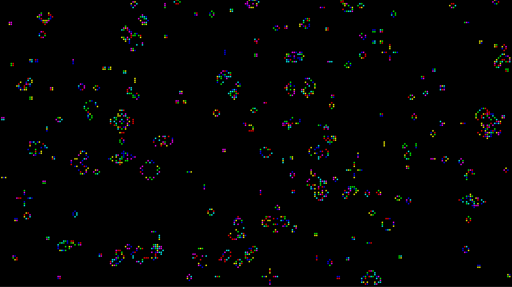

# Game of Life
Implementation of Conway's Game of Life in [Processing](https://processing.org)

## Demo
[Live demo](http://adjl.github.io/GameOfLife) written in [p5.js](http://p5js.org) featuring an alternative colour scheme; does not implement mouse events.

## Controls
`p` - Resume/pause the simulation  
`c` - Clear the grid  
`r` - Randomise the grid (generate a new seed)  
`q` - Quit

When the simulation is paused, you can move the mouse pointer around to highlight cells and to add/kill live ones.

`left-click` - Add live cell  
`right-click` - Kill cell

Mouse events are ignored when the simulation is running.

## Parameters
Modify the following in [`GameOfLife.pde`](GameOfLife.pde) to your preferences:
- `COLOURS` (default: red, green, blue, cyan, magenta, yellow)
- `BACKGROUND` (default: black)
- `ANIMATION_DELAY` (default: 100)
- `CELL_CHANCE_TO_LIVE` (default: 10)
  - Relevant only when randomising the grid
  - Must be greater than 0
  - 1 = 100%, 2 = 50%, 4 = 25%, etc.
- `CELL_SIZE` (default: 5)

## Note
- The simulation starts with a random seed.

## License
[MIT License](LICENSE)
